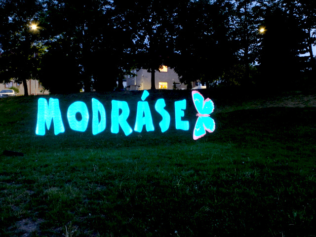

With lightstick you will be able to draw light images in real environment.

Lightstick is thin wooden batten with 120 NeoPixel LED's. Lighstick is connected 
to Arduino microcontroler with SD card. There are 2 images in 256 color pallete 
stored on SD card. On Arduino are two controls: switch for selecting one or 
other image and play button. After pressing play button simple countdown is 
displayed (5 red LEDs, 4, 3, 2, ...) and lightstick starts drawing image.
From this moment lightstick operator must walk slowly from left to right side
(from photographer point of view). Photographer must take picture in manual mode 
with some long exposure times (~5 seconds and more, according to image size
and current situation).

Images stored in lightsticks should have 120 pixel height and teoriticaly 
indefinited width.

## Repository content

* `lighstick/` directory with Arduino source code
* `lightimg.py` script for converting 256 color PNG images to `*.lig`. You must 
  have installed packages defined in `requirements.txt` file
* `files/` contains two "images" for lightpainting (`PNG`s are sources, `lig`s 
  are products of `lightimg.py` script which must be copied to SD card)
* `img/` demo photographs from lightstick tests

## SD card on Arduino Leonardo

Official documentation on Adafruit website (https://learn.adafruit.com/adafruit-micro-sd-breakout-board-card-tutorial/intro)
doesn't work. Follow this instructions to make SD card functional on Leonardo:
http://www.instructables.com/id/Connecting-Adafruit-SD-Card-Breakout-to-Leonardo/
